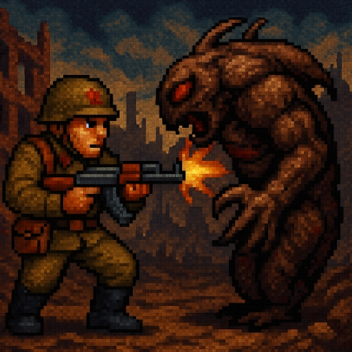

# The Soldier - Игровой проект

Soldier - это динамичная игра в жанрах Hack and Slash и RPG, действие которой разворачивается в постапокалиптическом СССР 1970-х годов. Вы играете за бывшего спецназовца Толю, который сражается против инопланетных захватчиков, известных как "иногады".

## Особенности игры

- 🎮 **Динамичные бои**: Интенсивные сражения с разнообразными монстрами
- 🧩 **Случайная генерация уровней**: Уникальный игровой опыт при каждом прохождении
- ⚔️ **Система прокачки**: Улучшайте характеристики персонажа и снаряжение
- 🛒 **Система торговли**: Покупайте и продавайте предметы у NPC
- 🔧 **Кастомизация оружия**: Модифицируйте оружие с помощью обвесов
- 🌑 **Атмосферный хоррор**: Мрачные локации и напряженная атмосфера
- 🕹️ **Ностальгическая графика**: Стиль старых шутеров в духе Doom 64

## Сюжет

После вторжения инопланетных захватчиков земная цивилизация была разрушена. Вы - бывший спецназовец Толя, один из немногих выживших. Ваша задача - сражаться с полчищами монстров, разрушить энергетические преобразователи захватчиков и победить их лидера, чтобы освободить Землю.

## Установка

Проект можно скачать на сайте: https://sstepp281.itch.io/raycasting

## Разработка

Проект разрабатывается с использованием:
- Язык программирования: C++
- Графический движок: Псевдо-3D на основе Raycasting
- Инструменты: SFML, SfeMovie
